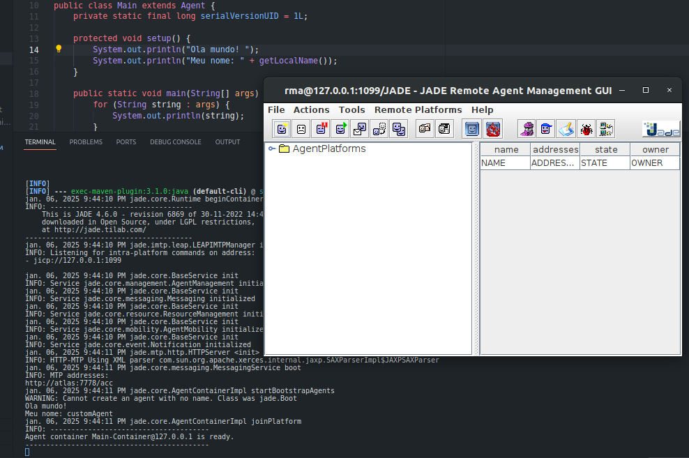

## Dependências

- Java
- [Maven](https://maven.apache.org/download.cgi) 3.5.4 
(eu prefiro instalar pelo [asdf](https://asdf-vm.com/guide/getting-started.html))
  - Plugin para Maven: https://github.com/halcyon/asdf-maven.

### Extensões úteis do VSCode

- [Extension Pack for Java](https://marketplace.visualstudio.com/items?itemName=vscjava.vscode-java-pack)

## Executar

No terminal, execute:

```sh
mvn exec:java -Dexec.mainClass=jade.Boot -Dexec.args="-gui -local-host 127.0.0.1 -local-port 1099 jade.Boot;customAgent:jade_starter.Main"
```

Você deve ver algo assim:


